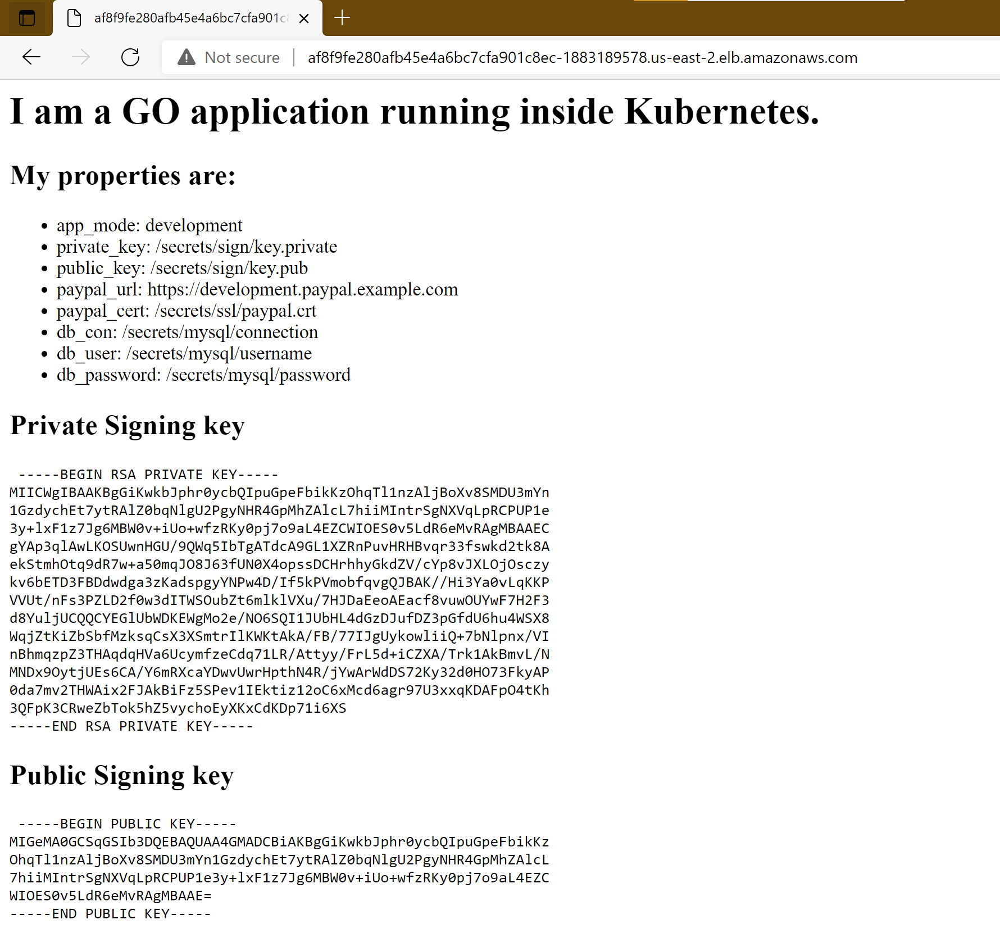

# Gitops with secrets

This is single application that uses [Bitnami sealed secrets](https://github.com/bitnami-labs/sealed-secrets) for
password and certificates.

## How to run locally

`go run .`

then visit http://localhost:8080 in your browser

## How to build and run the container

Run

 *  `docker build . -t my-app` to create a container image 
 *  `docker run -p 8080:8080 my-app` to run it

 then visit http://localhost:8080 in your browser

You can find prebuilt images at [https://hub.docker.com/r/kostiscodefresh/gitops-secrets-sample-app/tags](https://hub.docker.com/r/kostiscodefresh/gitops-secrets-sample-app/tags)

## How to work with secrets

**WARNING** just for demonstration purposes this repository contains both raw and encrypted
secrets so that you can see the sealing process yourself. In a real application, your Git repository should only have sealed secrets

Secret folders

 * `decrypted` contains the raw secrets (You should never commit this to Git)
 * `unsealed_secrets` contains plain Kubernetes secrets (You should never commit this to Git)
 * `sealed_secrets` contains sealed secrets (This is the only folder you should commit to Git)

## How to install the Bitnami secret controller

Install the secret controller

```
helm repo add sealed-secrets https://bitnami-labs.github.io/sealed-secrets
helm repo update
helm install sealed-secrets-controller sealed-secrets/sealed-secrets
```

By default the controller will be installed at the `kube-system` namespace. The namespace
and release name are important, since if you change the defaults, you need to set them up
with `kubeseal` as well as you work with secrets

Download the `kubeseal` CLI.

```
wget https://github.com/bitnami-labs/sealed-secrets/releases/download/v0.16.0/kubeseal-linux-amd64 -O kubeseal
sudo install -m 755 kubeseal /usr/local/bin/kubeseal
```

## How to work with bitnami sealed secrets

```
kubectl create ns git-secrets
cd sealed_secrets
kubeseal -n git-secrets < ../unsealed_secrets/db-creds.yml > db-creds.json
kubeseal -n git-secrets < ../unsealed_secrets/key-private.yml > key-private.json
kubeseal -n git-secrets  < ../unsealed_secrets/key-public.yml > key-public.json
kubeseal -n git-secrets < ../unsealed_secrets/paypal-cert.yml > paypal-cert.json
kubectl apply -f . -n git-secrets
```

You now have encrypted your plain secrets. These files are safe to commit to Git.
You can see that they have been converted automatically to plain secrets with the command

```
kubectl get secrets -n git-secrets
```

## How to deploy the application

Note that the application requires all secrets to be present

```
cd ../manifests
kubectl apply -f . -n git-secrets
```

Wait some time and then find the public IP of the loadbalancer of the application:

```
kubectl get svc -n git-secrets
``` 


If you now visit your application you will see it using the secrets:




See the [documentation page](https://codefresh.io/docs/docs/yaml-examples/examples/gitops-secrets/) for more details.

